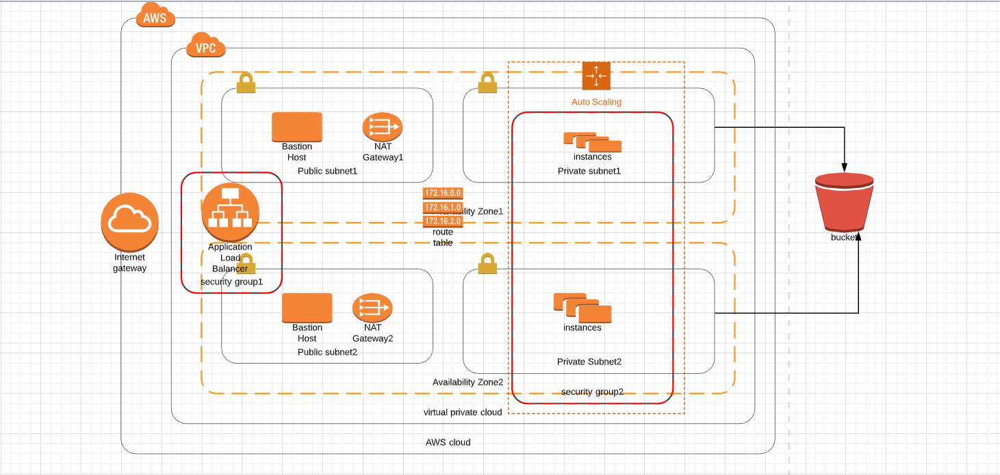

# High-availability-web-server--Udagram

Deployed highly available web server using CloudFormation Scripts. 

Created a Launch Configuration to deploy four servers in a private subnets, and a Load balancer and Bastion host in Public Subnets.

## Install
Need an AWS Account and also AWS CLI should we configured in your machine.

## PreRequisite
1.Should have basic knowledge on JSON or YAML formatting.
2.Should know basic cli commands to create and update stacks.
